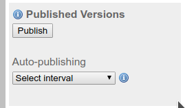
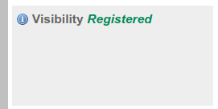

```{r setup, include=FALSE}
library(tufte)
# invalidate cache when the tufte version changes
knitr::opts_chunk$set(tidy = FALSE, cache.extra = packageVersion('tufte'))
options(htmltools.dir.version = FALSE)
```

# Introduction

This guide will help you to publish your data to OBIS and GBIF, and by doing this, obtain a DOI for your collection. 

This is an easy process that could be accomplished under 30 minutes. 
To publish your data you need to go through THREE easy steps:


1. **Build your metadata**. Data without the metadata is simply useless. In this step you will enter the description of the project, sampling methods, collaborators, funding agencies, etc. This is important as you want your data set, collaborators and institution acknowledge correctly. You will dedicate most of your time on this step.
2. **Match your data with Darwin Core (DwC) schema**. Since your data should already be formatted according to DwC terms, this is likely the easiest and quickest step. Just upload your files and review the matches.
3. **Publish your data**. As easy as three clicks!

At the last workshop, we agree that all data sets will be published in [OBIS](http://obis.org) and [GBIF](http://gbif.org), and after the data is there, we will produce two data papers, one for the Sandy Beach data and other for the Rocky shore data.

**If you don't have time or think that you will not be able to publish your data, just let us know. We can help you!**


Let's go step by step:


# Build your metadata

As it was mentioned, this step is as important as the collection of the data itself. 
You will fill the metadata section on the IPT installation of the MBON project.

1. Login into the [MBON IPT instalation](http://ipt.iobis.org/mbon) using the credentials we have set for you

NOTE: Your user name is your email address. If you don remember your password, just let us know!

2. You need to create a **new resource** (this is how IPT calls the data sets). Go to the **Manage Resources** tab and at the very bottom fill the fields of the  **Create new Resource** section.
  + Name your resource. It has to be a short name with no spaces or special characters. Don't worry too much as we will change the name to a proper one later.
  + Select the type of the resource as **Sampling EVENT**. This is very important as your data comply with this schema.
  + Click on **Create new Resource**. You will be redirected to the resource page you just created.


```{block2, note-text, type='rmdnote'}
NOTE: During the creation/edition process the data set (*the resource*) will be only visible to you until you finaly make it public.
```


You will see something like this:


## Basic Metadata

There are few things we need to keep constant across all data sets of the project. Other things are very particular to your dataset and you need to fill them up with the appropriate details.

So click on `Edit` in the matadata section and begin to fill the information required:

1. Modify the title of your resource. For the project your must use **MBON POLE TO POLE: SANDY BEACH BIODIVERSITY OF....** replacing SANDY BEACH for ROCKY SHORE if it necessary and complete the line with your locality, e.g. **MBON POLE TO POLE: SANDY BEACH BIODIVERSITY OF PLAYA DEL CARMEN**. All in **CAPITAL** letters.

2. Publishing organization select **Caribbean OBIS Node**

3. Update frequency, select **as needed**

4. Licence type: select **Creative Commons Attribution (CC-BY) 4.0**. This means that the user must attribute the data to the owner.

5. Description. Add a new paragraph with the following text: 

```
The MBON Pole to Pole effort seeks to develop a framework for the collection, use and sharing of marine biodiversity data in a coordinated, standardized manner leveraging on existing infrastructure managed by the Global Ocean Observing System (GOOS; IOC-UNESCO), the GEO Biodiversity Observation Network (GEO BON), and the Ocean Biogeographic Information System (OBIS). The MBON Pole to Pole aims to become a key resource for decision-making and management of living resource across countries in the Americas for reporting requirements under the Intergovernmental Science-Policy Platform on Biodiversity and Ecosystem Services (IPBES), Aichi Targets of the Convention of Biological Diversity (CBD), and the UN 2030 Agenda for Sustainable Development Goals (SDGs).
```

6. In the description, open another paragraph and add the information related to your sampling site. As a reference, see what Edlin _et al_ did in their [GBIF dataset landing page](https://www.gbif.org/dataset/36094b2b-bd50-4c6d-af52-264a155fc76f)

7. Resource contacts, creator and metadata provider: You need to fill the details of the person responsible for this data set, probably you. These are mandatory fields.

Click **Save**


## Geographical extent

Add the coordinates of your sampling site clicking on `set global coverage`. The field for coordinates will appear.

You also need to add a description of your locality, e.g. Sandy beach of Playa del Carmen, Mexico

## Taxonomic Coverage

Here you need to input all the scientific names of organisms found at your study site. 
You can easily extract this from the occurrence file of your site from the DataAnalysisFile folder in the projects Google drive.

Here is an example of the list of taxa from Puerto Madryn rocky shores sites:

```{r message=FALSE}
Occurrence = readr::read_csv("ARGENTINA_PUERTOMADRYN_PUNTAESTE_dashboard_occurrence.csv", progress = F)
sppList = unique(Occurrence$ScientificName_accepted)
## remove NAs
sppList = sppList[!is.na(sppList)]

## Write the names to a text file
writeLines(con="sppList.txt", sppList)
print(sppList)

```

Once you have your taxon list, click on **add new taxonomic coverage**, and **add several taxa**. 
You can paste here the list of your species. 
Once copied you will see one line per taxon. 
You could also add the taxonomic range of the name selecting it from the pull down beside each name. 
You should have something similar to this:


Click **Save**

## Temporal coverage

Add a new temporal coverage and enter the dates of your sampling. Click **Save**

## Keywords

Add a list of the keywords. Please include the following: 

```
MBON, Pole to Pole, LOCALITY (e.g. Montemar Reñaca, Valparaiso Bay, central Chile), rocky shores or sandy beach, intertidal zone, coastal biodiversity
```

Click **Save**

## Associated Parties

Here you will enter the details of your organization, funding agencies, collaborators, etc. Please select carefully the role of your collaborators.

Once finished, click **Save**

## Project Data

1. Title. Use the same name you used in the project title above.

2. Description. Copy the same description you used above.

3. Funding. Add the organization(s) that provide support for the sampling, and NASA as a funder for the global project:

```
The sampling, materials and personnel were financed by [YOUR INSTITUTION OR ANY OTHER INSTITUTION]. The Pole to Pole project is supported by the National Aeronautics and Space Administration (NASA) grant 80NSSC18K0318, ”Laying the foundations of the Pole-to-Pole Marine Biodiversity Observation Network (MBON) of the Americas”, and co-sponsored by AmeriGEO.
```

4. Study area Description. Input a general description of you sampling area here. E.g. Playa del Carmen is a sandy beach of xx Km long with tidal range of xx m. the mean temperature is xx C and presents seasonal upwellings during the first months of the year. There is an important coastal development, mostly for tourism and during high season we could expect hundred of people using the beach....  something like this. Example from Chile:

```
The study area belonging to Marine Protected Area Montemar within the premises of the Marine Science Department, Universidad de Valparaiso. The area is a semi-exposed rocky shore with bed rocks with some level of anthropogenic impact. Seasonality and upwelling could be considered as main drivers for benthic communities.
```

5. Design description: Copy the sampling design from the official methods for the corresponding sandy beach or rocky shore habitats. Please add the reference to the methods:

```
MBON Pole to Pole protocol for rocky intertidal areas (2018) available at https://marinebon.github.io/p2p/methods_field_protocols.html.

```

6. Project personnel: Here you will enter your collaborators and their specific role in the project. They all must be included in the citation of the data set. Carefully select the role of each of the collaborators.


## Sampling methods. 

Here you will enter the details of the project.

Study Extent: 

Summarize the area where the survey was done: Example from Colombia: 

```
This study was done in three sites (La Máncora, Playa Verde, and La Ventana) of one location (Gorgona Island) during one time (October 2018).
```

Sampling description: 

Input the information from the manual of the standard methods for the project depending if rocky or sandy beach sampling. or rocky shores add: 

```
Sampling is organized following a stratified design, which includes LOCATIONS, SITES, and STRATA. Note that LOCATIONS are separated by 30 – 100’s of kilometers. For each LOCATION on this case it was only one. Those SITES will be separated by units of kilometers (maximum 5 km). The selected site was divided in THREE STRATA (tidal levels) parallel to the coastline using the almost universal biologically-based characteristics of rocky shores of high-, mid- and low zones. In each stratum 10 QUADRATS were sampled, pictures from relevant animals were taken and animals and macroalgae samples were considered for further taxonomic identifications.

In the 10 QUADRATS within each stratum (tidal level), slow moving animals are counted and the percentage cover of space occupied by invertebrates and algae. The latter includes those organisms that cover a considerable fraction of the rock surface and that are too many to be counted or cannot be easily separated into individuals; e.g., barnacles, mussels, some colonial invertebrates, including zoanthids and ascidians, algal turfs or macroalgae. Organisms adhering directly to the rock surface and moving across it are considered the “primary layer”. If canopy-forming organisms such as macroalgae are present, then these
are moved aside for counts, cover and photographs in order to effectively quantify the primary layer. The composition of the canopy- the secondary layer- should also be conducted.
```

For sandy beaches:

```
Three linear transects, spaced more than 3 meters and less than 10 meters apart. The distance of the upper limit of the transects on each site was determined from a fixed reference point, starting immediately below the high tide level(below the drift line) to the lower level of the swash. Sampling were done on three to six equidistant points along the transects. Sampler was a corer of 15 centimeters in diameter, reaching up to 25 centimeters in the sediment.
```

Quality control

Please add the following text:

```
Taxonomic validity was verified using the World Register of Marine Species (WoRMS; www.marinespecies.org) and the Ocean Biogeographic Information System (OBIS; https://obis.org/)
```


Step Description:

```
Samples were processed following the rocky shore intertidal protocol developed during the Marine Biodiversity Workshop: from the Sea to the Cloud, at Praia do Segredo, São Sebastião, Brasil. August 6-10, 2018.
```


Click **Save**

## Citation

This is how the data set will be cited. Click on the *Autogeneration* to turn it on. Review the citation! The names that you entered in the *Resource Creators* section in Basic Metadata will appear here as authors. If you think that something or someone is missing, go back to the corresponding section and make the modifications. You can always edit this box to provide a more precise citation if you think it is needed.

If there is any relevant bibliographic reference associated with your data set you can add it in this section.

Resource Homepage

Please add the MBON web page. If your data or your local project has another webp page, you can add it here as well. 

```
https://marinebon.github.io/p2p/index.html
```

Once satisfied, click **Save**

## Collection data

If you collected samples and the organisms where deposited in a collection, you can add those details in this section.

Click **Save**  

## External Links

Please add the web page of the MBON P2P Project: `https://marinebon.github.io/p2p/index.html`

## Additional Metadata

Please add in the section **Additional Information** the following lines:

**MARINE DATA HARVESTED BY OBIS**
**A MBON POLE TO POLE PROJECT DATA SET**

click **Save**

With that you have finished the description of your data set. Remember that more detail is always better. Also, you can modify your metadata later and the tinges will be reflected on the GBIF and OBIS sites.


# Match your data in the IPT

For that step, the hard work is already done!
The scripts we have used to read the Excel data tables and transform it into something more practical to analyze also produced a set of files ready to be uploaded to the [MBON IPT](http://ipt.iobis.org/mbon).

You will need *three* files for you locality that are in the Google drive folder [00-DataCurated->IPTFiles](https://drive.google.com/open?id=1aXDbVtRminFY8LvE6Tc2r0mh9B4JjHXy). 
As usual, the files from the sandy beaches are in a different folder that the ones from the rocky shores. 
The files have the name of your locality/site and the prefixes `\_ipt_event`, `\_ipt_occurrence` and `\_ipt_MoF`. 
Those files correspond to the EVENT-DATA schema of OBIS. 

NOTE: if you have several localities as separated files and want to publish all as a single data set, we can help you to merge the data. Just let us know.

1. Go to the Google drive folder where the IPT files are and download to your computer the three IPT files for your locality. 

**IMPORTANT NOTE:** If you want to open the your data files in your computer using excel, please note that excel will almost certainly change the format of the `eventDATE` variable and if your system is in Spanish, it will also change de field separator to semi-colon and the decimal point to comma. The IPT will not recognize those changes and you won't be able to match your data. If you open your file in excel, **PLEASE DO NOT SAVE IT AGAIN!** unless you take care of those details.

2. In the IPT go to the tab **Manage Resources** and select your newly created data set. This will direct you to your resource main page, if you are not already there. 

3. Upload your files: Go to the section **Source Data** and select your files one by one. There will be a page confirming the number of records read and other details that you need to acknowledge. Once your three files are uploaded you will see them in the right side panel. This is an example from Colombia:


4. Match your files with the event core and occurrence and MoF extensions. 

**IMPORTANT NOTE:**. You must select first **Darwing Core Event**. If not, the required extensions might not be available in the next step.


After each of the core/extension selected, you will be prompted or a file to match:

- Core Event --> SITE_ipt_event.csv
- Darwin Core Occurrence --> SITE_ipt_occurrence.csv
- Extended Measurements or Facts --> SITE_ipt_mof.csv


5. Review the matching: In each of the components of the DwC you will verify that the fields of your data table match with the DwC terms. You can also review the matching as follow:

  + Click on the **Edit** button at the right of the **Event file**. You will be directed to the page of the Event core fields. Verify that the names of the fields of your table correspond with the names of the Event core. Normally everything is correctly matched so you only need to click **Save**. Once saved, click **Back**.
  + Click on the **Edit** button at the right of the occurrence file. You will be directed to the page of the occurrence extension. As in the previous step, everything is correctly matched. We even changed the `scientificName` field with `scientificName_accepted` as this is the one we extracted from WoRMS. Again, everything should be correctly matched, so you only need to click **Save**. Once saved, click **Back** 
  + Click on the **Edit** button at the right of the mof file. Again, everything should match well.  
  
Now your data is in the IPT with the correct Darwin Core format. You're ready to publish:


# Publish your data

Once the metadata has been completed and your data matched with the DwC terms of the core and extensions, you are ready to publish your data. You need to follow three easy steps:

 + Change the visibility to **PUBLIC** to make your data publicly available. Do nothing with the Auto-publishing option:


 + Publish your data clicking on the Publish button. This action will make your data to be harvested by OBIS in the next few minutes.
 




 Congratulations!!! You've just published your dataset in OBIS. Go to the [OBIS portal](http://obis.org), search by dataset and start typing MBON... your collection should appear along with the other MBON datasets. Click on your dataset and you will land in your data home page. Check the information about quality control ckecks performed automatically by OBIS. It is a good way to spot problems in your records. 


  + Register your data set to GBIF, clicking on Register in the visibility panel. After acceptingt GBIF terms, your data set will be collected by GBIF in the next few minutes. GBIF will provide you with a landing page with a DOI for your data.




In few minutes your data will be in GBIF. 


Remember that you can always update your data and metadata in the IPT and the changes will be reflected in both systems within minutes after you click the Publish button again.


Finally, if you have questions or concerns about this process do not hesitate to contact us.


Well done!!


